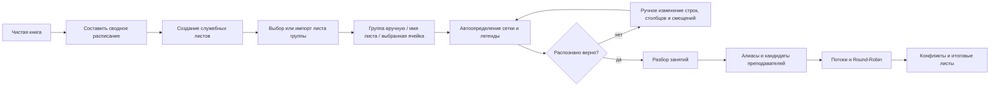

# 🧰 ПрофиПомощник для Excel

Надстройка для кадровых служб, рекрутинга, преподавателей, работников и учебных подразделений. Проект объединяет функции в ячейках, массовые апплеты и составитель сводного преподавательского расписания.

## ✨ Возможности

- **114 функций `PROFI`** в современном Office.js-режиме;
- **44 апплета** для ФИО, кадров, рекрутинга, обучения и планирования;
- импорт или выбор групповых листов;
- название группы вручную, из имени листа или из выбранной ячейки;
- автоматическое распознавание сетки и легенды с ручным исправлением каждого параметра;
- преподавательские алиасы, потоковые занятия, детерминированный Round-Robin и контроль конфликтов;
- автоматическое создание и восстановление всех `_PROFI_*` листов;
- сводное расписание, выбранная неделя, нагрузка преподавателей и занятость аудиторий;
- отдельный **Legacy XLAM/VBA-контур** для Excel 2010, 2013 и 2016 под Windows.

> Отдельного выпуска Microsoft Office 2012 не существовало. Для компьютеров этого периода поддерживаются Office 2010 и Office 2013.

## 💻 Совместимость

| Клиент | Режим | Возможности |
|---|---|---|
| Microsoft 365 Excel Windows/macOS/Web | `manifest.xml` | Полная панель, 114 Custom Functions, 44 апплета, составитель расписания |
| Excel 2016 Windows с ExcelApi 1.1 | `manifest-office2016.xml` | Облегчённая ES5-панель; полный набор legacy-команд через XLAM |
| Excel 2010/2013/2016 Windows | `ProfiExcelHelper-Legacy.xlam` | VBA-UDF, меню, служебная схема, парсер и составитель расписания |
| Старые Excel для macOS | ограниченно | Современный Office.js — по фактическим requirement sets; legacy-пакет ориентирован на Windows |

Подробности и ограничения: [совместимость](docs/COMPATIBILITY.md) и [legacy-режим](docs/LEGACY_OFFICE.md).

## 🚀 Проверка и запуск современной надстройки

```bash
git clone https://github.com/f2re/excel_helper.git
cd excel_helper
npm ci
npm run check
npm start
```

После запуска используйте `dist/manifest.xml`. Для совместимого task-pane режима Excel 2016 используйте `dist/manifest-office2016.xml`.

## 🧩 Сборка Legacy XLAM

На Windows с установленным Excel:

```powershell
powershell -ExecutionPolicy Bypass -File legacy-vba\scripts\build-xlam.ps1
powershell -ExecutionPolicy Bypass -File legacy-vba\scripts\install-xlam.ps1
```

Подробная инструкция: [legacy-vba/README.md](legacy-vba/README.md).

## 📅 Составление сводного расписания



Все системные страницы создаются при первом запуске либо восстанавливаются, если пользователь их удалил. Подробный flow: [SCHEDULE_WORKFLOW.md](docs/SCHEDULE_WORKFLOW.md).

## 📚 Документация

- [Индекс](docs/INDEX.md)
- [Установка](docs/INSTALLATION.md)
- [Руководство пользователя](docs/USER_GUIDE.md)
- [Сводное расписание](docs/SCHEDULE_WORKFLOW.md)
- [Совместимость](docs/COMPATIBILITY.md)
- [Office 2010–2016 / XLAM](docs/LEGACY_OFFICE.md)
- [Архитектура](docs/ARCHITECTURE.md)
- [Разработка](docs/DEVELOPMENT.md)
- [Тестирование](docs/TESTING.md)
- [Диагностика](docs/TROUBLESHOOTING.md)
- [Функции](docs/FUNCTIONS.md)
- [Апплеты](docs/APPLETS.md)

## 🧪 Контроль качества

`npm run check` выполняет генерацию каталогов, синтаксическую проверку, legacy-аудит, тесты, проверку манифестов и документации, production-сборку и smoke-тест `dist/`.

Автоматическая проверка не заменяет ручной запуск в целевом клиенте Excel. Перед корпоративным развёртыванием выполните сценарии из [TESTING.md](docs/TESTING.md).

## 🔐 Приватность

Проект не требует отдельного backend. Исходные листы и расчётные таблицы хранятся в текущей книге. Скрытые листы не считаются средством защиты от пользователя, имеющего доступ к файлу.

## 📄 Лицензия

MIT — [LICENSE](LICENSE).
