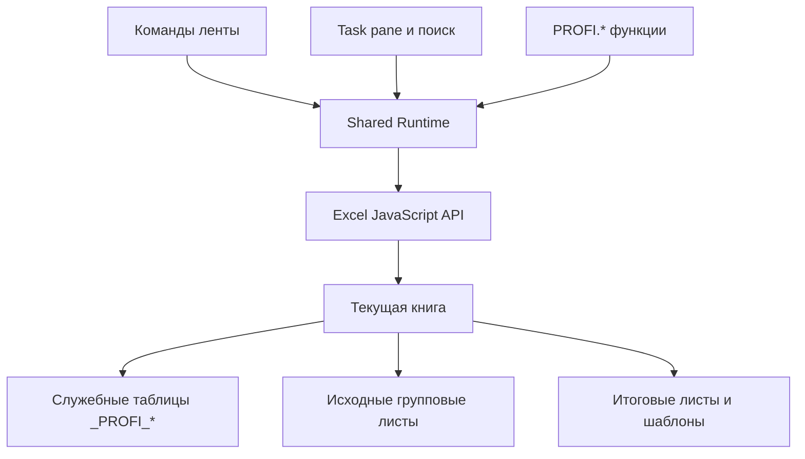
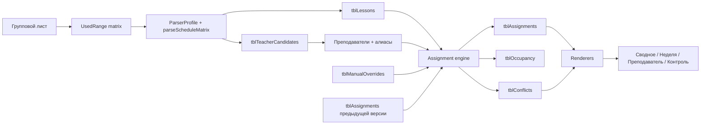

# 🏗 Архитектура

## 1. Общая модель

ПрофиПомощник — client-side Office Add-in на TypeScript и Office.js. Он использует XML add-in-only manifest и SharedRuntime 1.1.



Отдельный backend отсутствует. Production требует только статического HTTPS-хостинга файлов надстройки.

## 2. Модули

| Каталог | Ответственность |
|---|---|
| `src/core` | нормализация текста, даты, ID, shared state |
| `src/workbook` | схема листов/таблиц, чтение, запись, маппинг и самовосстановление |
| `src/schedule` | импорт, парсинг, разрешение преподавателей, назначения, рендеринг |
| `src/functions` | реализации функций и регистрация CustomFunctions |
| `src/actions` | апплеты, массовые операции, отчёты и шаблоны |
| `src/commands` | обработчики кнопок ленты |
| `src/taskpane` | интерфейс, маршруты, поиск, мастер расписания |
| `scripts` | генераторы, bundler, HTTPS-сервер, тесты и валидация |

## 3. Книга как хранилище проекта

### Системные листы

| Лист | Таблицы |
|---|---|
| `_PROFI_SETTINGS` | настройки, профили парсера, статусы |
| `_PROFI_TEACHERS` | преподаватели и алиасы |
| `_PROFI_SOURCES` | зарегистрированные групповые листы |
| `_PROFI_DATA` | занятия, кандидаты, календарь |
| `_PROFI_CALC` | назначения, занятость, конфликты, overrides |
| `_PROFI_LOG` | журнал и версии |

### Инварианты

1. Любая основная команда сначала вызывает `ensureProjectScaffold()`.
2. Если листа или таблицы нет, он создаётся.
3. Если у таблицы отсутствуют обязательные колонки, они добавляются.
4. Seed-данные добавляются только при отсутствии соответствующих строк.
5. Существующие рабочие строки не очищаются при обычном восстановлении структуры.
6. Служебные листы скрываются после операции, но пользователь может их открыть.

## 4. Поток данных расписания



## 5. Почему используются нормализованные таблицы

Исходные расписания могут содержать:

- объединённые ячейки;
- месяцы, растянутые на несколько столбцов;
- код, предмет и аудиторию в разных строках;
- легенду далеко под сеткой;
- разные форматы ФИО.

Нормализация «одно занятие = одна строка» позволяет:

- независимо проверять данные;
- обновлять только один источник;
- сохранять стабильные ID;
- строить несколько представлений;
- хранить ручные правила отдельно;
- восстанавливать версии назначений.

## 6. Движок назначений

Движок — чистая TypeScript-функция без Office API. Это позволяет тестировать её в Node.js.

Основные структуры:

```text
ParsedLesson[]
TeacherCandidateRecord[]
ScheduleSettings
ManualOverrideRecord[]
AssignmentRecord[] previous
```

Результат:

```text
assignments[]
occupancy[]
conflicts[]
```

Детерминированная сортировка обеспечивает одинаковый результат при одинаковом состоянии книги.

## 7. Пользовательские функции

Канонический каталог находится в `scripts/function-catalog.mjs`. Из него генерируются:

```text
src/functions/definitions.json   # данные для UI и документации
src/functions/functions.json     # metadata Custom Functions
```

`src/functions/functions.ts` регистрирует реализации через `CustomFunctions.associate`.

Преимущество схемы:

- внутренний стабильный ID на латинице;
- русское отображаемое имя в Excel;
- единый источник параметров, примеров и описаний;
- автоматический контроль совпадения всех 114 реализаций.

## 8. Сборка

Проект использует небольшой собственный CommonJS bundler поверх TypeScript compiler API. Это уменьшает количество production-зависимостей.

Сборка создаёт:

```text
dist/
├── taskpane.html
├── taskpane.js
├── taskpane.css
├── functions.json
├── manifest.xml
└── assets/*.png
```

Иконки генерируются Node-скриптом и не хранятся как бинарные исходники.

## 9. Ограничения и компромиссы

- Workbook-as-database удобен для прозрачности, но большие книги требуют контроля объёма.
- Версии назначений хранятся частями по 30 000 символов, чтобы не создавать чрезмерно длинные ячейки.
- Геометрию неизвестного шаблона нельзя гарантированно определить без участия пользователя, поэтому preview и ручные координаты являются частью обязательного flow.
- Чистая логика покрыта тестами, но Office API требует smoke-тестов в фактических клиентах Excel.
